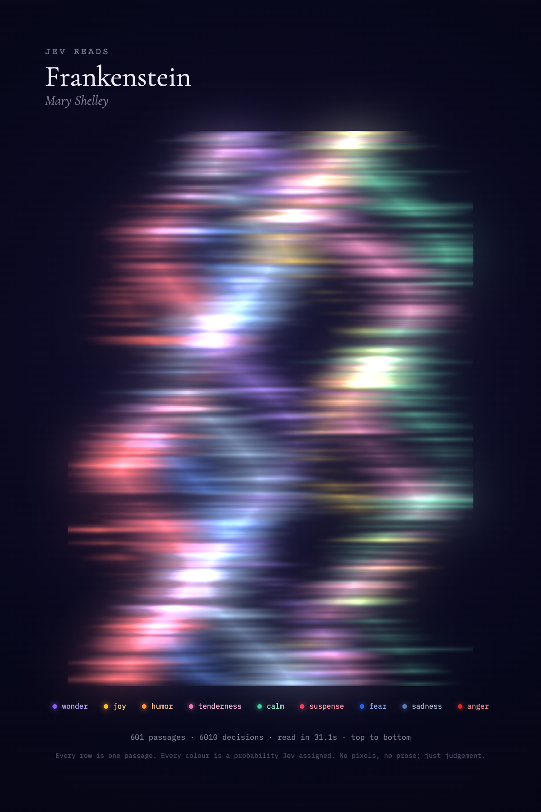

# Book Aurora

Jev reads a whole novel in under a minute. Every passage becomes a row of colour.


Each ~90-word passage is sent to [Jev](https://typesafe.ai) (TypeSafe's System One decision model) with ten
parallel typed questions: a 0–3 score for each of nine emotions, plus overall intensity. Jev never sees
pixels and never writes prose; it only returns scores with calibrated probabilities. The aurora draws one
feathered row per passage, each emotion a curtain whose width and brightness follow its score. When the
book is done, the whole strip is the book's emotional weather, and you can save it as a poster.

## Run

```sh
bun install
bun run dev          # Vite on :5173, Bun API server on :4319
```

Set `OPENROUTER_API_KEY` (Jev via OpenRouter's `/api/alpha/decisions`, model `typesafe/jev-1.13`) or
`TYPESAFE_AI_API_KEY` (native `api.typesafe.ai`) in `.env` or your shell. With neither, the app runs in
a keyword-driven mock mode so you can work on the visuals.

Optional: `JEV_MODEL`, `JEV_CONCURRENCY` (default 6), `PORT` (default 4319).

URL parameters: `auto` starts reading on load, `book=<id>` picks a book, `kiosk` hides the controls for
screen recording, `look=aligned` switches from the flowing aurora to fixed labelled columns.

## Books

Drop any plain-text novel into `books/` as `<id>.txt`. Project Gutenberg files work as-is: the header and
licence are stripped, `Title:` / `Author:` are read, and `CHAPTER …` headings become the ticks along the
ribbon. Only public-domain texts belong in `books/`. Anything in `books/private/` is git-ignored, for
reading books you own locally; the resulting poster contains no text, only colour.

## Production

```sh
bun run build && bun run start   # serves dist/ and the API from one Bun process
```

## Example poster



Texts in `books/` are from [Project Gutenberg](https://www.gutenberg.org) and in the public domain.
